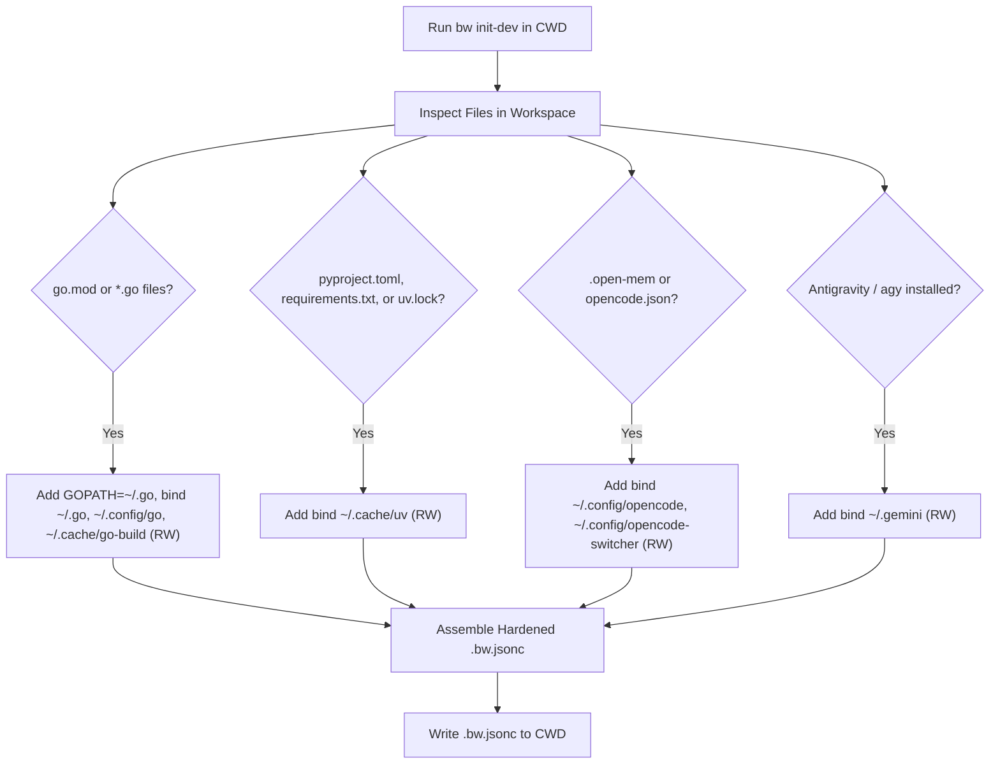

# Bubblewrap Automatic Development Sandbox Specification (`bw init-dev`)

This document specifies the design, requirements, and implementation plan for adding automated development sandbox initialization (`bw init-dev`) natively to the `bw` (bubblewrap sandbox launcher) utility.

---

## 1. Executive Summary & Goals

### Purpose
When developing software or allowing agentic coding assistants (such as Google Antigravity / `agy`) to modify codebases, execution should be confined to the project workspace. However, the agent must retain access to necessary developer toolchains (compilers, linters, package caches, language servers, and Git/SSH credentials) while being prevented from tampering with host system binaries or modifying directories outside the project root.

### Core Objectives
1. **Zero-Configuration Setup**: Running `bw init-dev` in any project folder automatically inspects the workspace, identifies the language/tooling stack, and creates a project-specific `.bw.jsonc`.
2. **Security & Containment**: Ensure host binaries (`~/.local/bin`, `~/bin`, `~/.cargo/bin`) and sensitive configuration files (`~/.gitconfig`, `~/.ssh/config`) are mounted **Read-Only**.
3. **Agent State Persistence**: Ensure agent state (e.g., `~/.gemini` for Antigravity, `~/.config/opencode` for OpenCode) and language caches (e.g., `~/.go`, `~/.cache/go-build`, `~/.cache/uv`) are mounted **Read-Write** in their proper isolated paths.
4. **Seamless Authentication**: Enable SSH agent forwarding with proper `GIT_SSH_COMMAND` configuration so remote Git operations against GitHub work without revealing private keys on disk.

---

## 2. Security & Containment Architecture

### 2.1 Mount Matrix & Protection Model

| Category | Host Path | Sandbox Target | Mount Mode | Rationale |
| :--- | :--- | :--- | :--- | :--- |
| **Project Workspace** | `CWD` | `CWD` | **Read-Write** | Workspace under development. Bound automatically by `bw`. |
| **Sandbox Home** | `~/.sandbox/pi_generic` | `/home/sariel` | **Read-Write** | Shields the host `$HOME` directory from rogue file writes. |
| **Agent State** | `~/.gemini` | `/home/sariel/.gemini` | **Read-Write** | Required by `agy` for sessions, MCP servers, and workspace trusts. |
| **Host Tool Binaries** | `~/.local` | `/home/sariel/.local` | **Read-Only** | Exposes `agy`, `ast-grep`, `repomix`, and `uv` without risk of binary poisoning. |
| **User Scripts** | `~/bin` | `/home/sariel/bin` | **Read-Only** | Exposes `agy-run`, `bw`, and custom utilities. |
| **Git Configuration** | `~/.gitconfig`, `~/.git-credentials` | `/home/sariel/...` | **Read-Only** | Prevents an agent from modifying host git hooks, aliases, or credentials. |
| **SSH Configuration** | `~/.ssh/config`, `~/.ssh/known_hosts` | `/home/sariel/.ssh/...` | **Read-Only** | Allows host resolution and fingerprint verification while preventing config alteration. |
| **Go Toolchain** | `~/.go`, `~/.config/go`, `~/.cache/go-build` | `/home/sariel/...` | **Read-Write** | Shared module cache and build cache (`GOPATH=/home/sariel/.go`). |
| **Python / UV Cache** | `~/.cache/uv` | `/home/sariel/.cache/uv` | **Read-Write** | UV tool and virtualenv cache. |
| **OpenCode Configs** | `~/.config/opencode`, `~/.config/opencode-switcher` | `/home/sariel/.config/...` | **Read-Write** | Present when OpenCode plugins/profiles are detected. |

---

## 3. Project Detection Heuristics

`bw init-dev` inspects the project directory and dynamically populates `.bw.jsonc`:



### Detection Rules:
1. **Go Detection**:
   - Triggers if `go.mod` exists or any `**/*.go` files are present.
   - Adds `"env": { "GOPATH": "/home/sariel/.go" }`.
   - Adds RW mounts: `~/.go`, `~/.config/go`, `~/.cache/go-build`.
2. **Python / UV Detection**:
   - Triggers if `pyproject.toml`, `requirements.txt`, `Pipfile`, or `uv.lock` exists.
   - Adds RW mount: `~/.cache/uv`.
3. **OpenCode Detection**:
   - Triggers if `.open-mem/`, `opencode.json` exists, or directory name contains `opencode` / `oc`.
   - Adds RW mounts: `~/.config/opencode`, `~/.config/opencode-switcher`.
4. **Antigravity / Coding Agents**:
   - Always enabled by default: `~/.gemini` (RW), `~/.local` (RO), `~/bin` (RO).
5. **Git / SSH**:
   - Sets `"features": { "enable_ssh": true }`.
   - Sets `"env": { "GIT_SSH_COMMAND": "ssh -F /home/sariel/.ssh/config" }`.
   - Adds RO mounts: `~/.ssh/config`, `~/.ssh/known_hosts`, `~/.gitconfig`, `~/.git-credentials`.

---

## 4. Implementation Details in `bw` (Go Codebase)

The source codebase for `bw` is located in `/home/sariel/prog/26/misc/bubblewrap_script/`.

### 4.1 New CLI Command: `bw init-dev` (or `bw conf init --dev`)
Add a new command in `internal/cli/` (or `main.go`):
- `bw init-dev [flags] [TARGET_DIR]`
- Supported Flags:
  - `-f, --force`: Overwrite existing `.bw.jsonc` without error.
  - `-n, --dry-run`: Print the generated JSONC to stdout without writing to disk.
  - `--no-ssh`: Omit SSH forwarding and Git SSH commands.
  - `--opencode`: Force inclusion of OpenCode configuration mounts.
  - `--preset <name>`: Explicitly select a preset (`go`, `python`, `node`, `rust`, `agent`).

### 4.2 Module Structure Additions
```
bubblewrap_script/
├── internal/
│   ├── config/
│   │   ├── config.go            # Existing JSONC config parser/merger
│   │   ├── detect.go            # NEW: Workspace inspection & feature detection
│   │   └── init_dev.go          # NEW: Generation of hardened .bw.jsonc structure
│   ├── cli/
│   │   ├── init_dev_cmd.go      # NEW: Cobra / CLI handler for `bw init-dev`
│   │   └── conf.go              # Existing conf subcommands
│   └── ...
├── main.go
└── Makefile
```

### 4.3 `detect.go` Specification
```go
package config

type ProjectFeatures struct {
    HasGo       bool
    HasPython   bool
    HasRust     bool
    HasNode     bool
    HasOpenCode bool
    EnableSSH   bool
}

func DetectFeatures(dir string) (ProjectFeatures, error) {
    // Scan directory for marker files:
    // go.mod, *.go -> HasGo
    // pyproject.toml, uv.lock, requirements.txt -> HasPython
    // Cargo.toml -> HasRust
    // package.json -> HasNode
    // .open-mem, opencode.json -> HasOpenCode
}
```

### 4.4 `init_dev.go` Specification
```go
package config

func GenerateDevConfig(features ProjectFeatures, targetDir string) (*Config, error) {
    cfg := &Config{
        Features: FeaturesConfig{
            EnableSSH: features.EnableSSH,
        },
        Env: map[string]string{
            "GOPATH": "/home/sariel/.go",
        },
        BindsRW: [][]string{
            {"~/.gemini", "/home/sariel/.gemini"},
        },
        BindsRO: [][]string{
            {"~/bin", "/home/sariel/bin"},
            {"~/.local", "/home/sariel/.local"},
            {"~/.gitconfig", "/home/sariel/.gitconfig"},
            {"~/.git-credentials", "/home/sariel/.git-credentials"},
            {"~/.ssh/config", "/home/sariel/.ssh/config"},
            {"~/.ssh/known_hosts", "/home/sariel/.ssh/known_hosts"},
        },
    }

    if features.EnableSSH {
        cfg.Env["GIT_SSH_COMMAND"] = "ssh -F /home/sariel/.ssh/config"
    }

    if features.HasGo {
        cfg.BindsRW = append(cfg.BindsRW,
            []string{"~/.cache/go-build", "/home/sariel/.cache/go-build"},
            []string{"~/.config/go", "/home/sariel/.config/go"},
            []string{"~/.go", "/home/sariel/.go"},
        )
    }

    if features.HasPython {
        cfg.BindsRW = append(cfg.BindsRW, []string{"~/.cache/uv", "/home/sariel/.cache/uv"})
    }

    if features.HasOpenCode {
        cfg.BindsRW = append(cfg.BindsRW,
            []string{"~/.config/opencode", "/home/sariel/.config/opencode"},
            []string{"~/.config/opencode-switcher", "/home/sariel/.config/opencode-switcher"},
        )
    }

    return cfg, nil
}
```

---

## 5. Standard Output Format (`.bw.jsonc`)

Below is the standard generated configuration for a Go + Antigravity workspace:

```jsonc
{
  "features": {
    "enable_ssh": true
  },
  "env": {
    "GOPATH": "/home/sariel/.go",
    "GIT_SSH_COMMAND": "ssh -F /home/sariel/.ssh/config"
  },
  "binds_rw": [
    ["~/.gemini", "/home/sariel/.gemini"],
    ["~/.cache/go-build", "/home/sariel/.cache/go-build"],
    ["~/.config/go", "/home/sariel/.config/go"],
    ["~/.go", "/home/sariel/.go"],
    ["~/.config/opencode", "/home/sariel/.config/opencode"],
    ["~/.config/opencode-switcher", "/home/sariel/.config/opencode-switcher"]
  ],
  "binds_ro": [
    ["~/bin", "/home/sariel/bin"],
    ["~/.local", "/home/sariel/.local"],
    ["~/.gitconfig", "/home/sariel/.gitconfig"],
    ["~/.git-credentials", "/home/sariel/.git-credentials"],
    ["~/.ssh/config", "/home/sariel/.ssh/config"],
    ["~/.ssh/known_hosts", "/home/sariel/.ssh/known_hosts"]
  ]
}
```

---

## 6. Verification and Testing Checklist

When implementing and validating `bw init-dev`:

1. **Unit Tests**:
   - Test feature detection against mock directory trees (Go, Python, OpenCode).
   - Test JSON formatting and JSONC comment preservation.
2. **Integration Verification inside Sandbox**:
   - `bw exec -- go env GOPATH` must resolve to `/home/sariel/.go`.
   - `bw exec -- touch ~/.local/bin/test` must fail with `Read-only file system`.
   - `bw exec -- touch ~/.ssh/config` must fail with `Read-only file system`.
   - `bw exec -- git ls-remote git@github.com:...` must authenticate via host SSH agent without errors.
   - `bw exec -- agy-run -p "..."` must execute and persist transcripts into `~/.gemini`.
