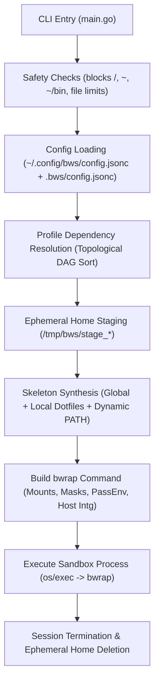
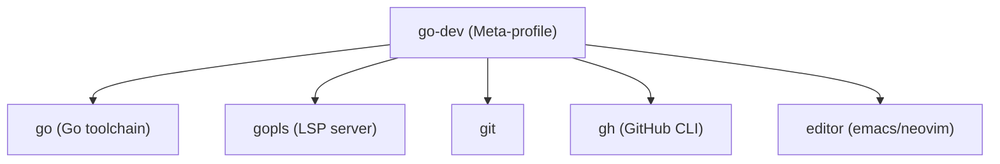

# `bws` architecture & internal design

This document provides a deep technical reference for developers, security engineers, and contributors wanting to understand the internal design, security guarantees, and execution lifecycle of **`bws`** (Bubblewrap Sandbox).

---

## Table of contents

* [1. Zero-privilege execution model](#1-zero-privilege-execution-model)
* [2. Complete invocation lifecycle](#2-complete-invocation-lifecycle)
* [3. Ephemeral home staging & skeleton synthesis](#3-ephemeral-home-staging--skeleton-synthesis)
* [4. Configuration hierarchy & merging semantics](#4-configuration-hierarchy--merging-semantics)
* [5. Capability profile engine & dependency resolution](#5-capability-profile-engine--dependency-resolution)
* [6. Path masking & security hardening engine](#6-path-masking--security-hardening-engine)
* [7. Workspace mounting & isolation](#7-workspace-mounting--isolation)
* [8. Host integration: SSH, WSL2, and X11](#8-host-integration-ssh-wsl2-and-x11)
* [9. Smoke testing framework](#9-smoke-testing-framework)

---

## 1. Zero-privilege execution model

`bws` is designed around the principle of **least privilege**:

* **Unprivileged user namespaces**: `bws` executes [`bwrap`](https://github.com/containers/bubblewrap) in unprivileged user mode (`CLONE_NEWUSER`). No root permissions, setuid binaries, or root daemons (like Docker) are required.
* **Hermetic isolation**: By default, namespaces for mount points (`CLONE_NEWNS`), process trees (`CLONE_NEWPID`), inter-process communication (`CLONE_NEWIPC`), and hostname/domain (`CLONE_NEWUTS`) are completely unshared from the host.
* **Process lifecycle**: Using `--die-with-parent`, all processes spawned inside the sandbox terminate automatically when the parent `bws` process exits or is killed.

---

## 2. Complete invocation lifecycle

When a command like `bws`, `bws exec -- <cmd>`, or `bws test <profile>` is invoked, `bws` executes the following sequence:



---

## 3. Ephemeral home staging & skeleton synthesis

Rather than exposing or modifying the host user's `$HOME`, `bws` provisions an ephemeral workspace:

1. **Unique stage directory**: Created under `/tmp/bws/stage_<pid>_<timestamp>/`.
2. **Skeleton overlay**:
   * Files from `~/.config/bws/skeleton/` (global user defaults) are copied into the stage.
   * Files from `.bws/skeleton/` (project-specific defaults) are overlaid on top.
3. **Mountpoint pre-creation**: Any directory or file scheduled to be mounted or masked under `@@HOME@@` is pre-created inside the stage directory to guarantee `bwrap` mount targets exist.
4. **Dynamic `.bashrc` synthesis**: `bws` injects dynamic profile PATH entries, environment variables, and interactive prompt themes (such as `oh-my-posh`) into the staged `.bashrc`.
5. **Automatic cleanup**: When `bws` exits (even on error or interrupt), the temporary stage directory is deleted from `/tmp/bws/`.

---

## 4. Configuration hierarchy & merging semantics

`bws` uses layered **JSONC** (JSON with Comments) configuration:

| Scope | Location | Purpose |
| :--- | :--- | :--- |
| **Global** | `~/.config/bws/config.jsonc` | User defaults, default editor, standard `pass_env` |
| **Local** | `.bws/config.jsonc` (project root) | Project-specific profiles, extra mounts, env variables |

### Merging rules

* **Maps & hashes** (`env`): Deep merged. Local keys override global keys.
* **Lists & arrays** (`profiles`, `mask`, `pass_env`, `path`, `binds_rw`, `binds_ro`): Merged and deduplicated while preserving declaration order.
* **Tokens**: `@@HOME@@` is dynamically expanded to the target sandbox user home directory at launch time.

---

## 5. Capability profile engine & dependency resolution

Profiles modularize bind mounts, environment variables, path additions, security masks, and verification smoke tests into reusable units.



### Profile discovery

1. **Local profiles**: `.bws/profiles/*.json` in current workspace.
2. **Global profiles**: `~/.config/bws/profiles/*.json`.
3. **Embedded profiles**: Catalog of 35+ profiles compiled directly into the `bws` binary.

### Profile CLI operations

```bash
# Search profiles across local, embedded, and Homebrew catalog
bws profile search <query>

# List all available profiles
bws profile list

# Inspect resolution plan
bws profile show <name>

# Synthesize a new profile using Homebrew & Firejail intelligence
bws profile new <name>

# Fetch community profiles from GitHub
bws profile fetch <name>
```

---

## 6. Path masking & security hardening engine

`bws` implements zero-trust **path masking** to hide sensitive host binaries, files, and directories from running code or untrusted agents:

### Masking semantics

* **Directories**: Mounted with an empty `tmpfs` (`--tmpfs <path>`). In-sandbox processes see an empty, non-writable folder.
* **Files & binaries**: Overlaid with `/dev/null` (`--ro-bind-try /dev/null <path>`). Execution or reading fails immediately (0-byte file, unexecutable).

### Masked security targets

* **`no-sudo`**: Blocks `/usr/bin/sudo`, `su`, `pkexec`, `doas`, `gpasswd`, `newgrp`, `/etc/sudoers`, and `/etc/sudoers.d`.
* **`no-ssh`**: Blocks `~/.ssh` and `/etc/ssh/ssh_config`.
* **`no-browser`**: Blocks Mozilla, Chrome, Chromium, Brave, and Edge profile stores.
* **`no-email`**: Blocks Thunderbird, Evolution, Mutt, and Maildir mailboxes.
* **`no-secrets`**: Blocks `~/.aws`, `~/.azure`, `~/.config/gcloud`, `~/.password-store`, `~/.gnupg`, `~/.vault-token`.
* **`no-history`**: Blocks `.bash_history`, `.zsh_history`, `.python_history`, `.psql_history`.
* **`.bws/` workspace auto-masking**: When running in a project workspace, the `.bws/` directory and `.bws.jsonc` file are **automatically masked by default**. In-sandbox processes cannot inspect or tamper with sandbox launcher rules.

---

## 7. Workspace mounting & isolation

When launching `bws` in a project directory:

1. **Direct mount**: The current working directory (`$PWD`) is mounted at its exact absolute path inside the sandbox (`--bind $PWD $PWD` by default, or `--ro-bind $PWD $PWD` via `-r`).
2. **Seamless builds**: Absolute paths in compiler outputs, stack traces, and debuggers match host paths exactly.
3. **Host isolation**: The rest of `$HOME` is completely unmapped; only explicit read-only tools and requested caches (`~/.cache/go-build`, `~/.cargo/bin`, etc.) are mounted.

---

## 8. Host integration: SSH, WSL2, and X11

* **SSH agent & deploy keys**: Auto-detects `SSH_AUTH_SOCK` or launches a persistent agent. When operating in a Git repository connected to GitHub, `bws` can automatically provision and register an isolated deploy key via `gh` with zero manual configuration.
* **WSL2 clipboard & interop**: Automatically binds `/run/WSL` and propagates `WSL_INTEROP` so Windows clipboard and tools function inside the sandbox.
* **X11 GUI forwarding**: Securely binds `/tmp/.X11-unix` and forwards `$DISPLAY` for graphical editors (Emacs, GUI diff tools).

---

## 9. Smoke testing framework

`bws` includes an automated testing framework (`bws test <profile>`) that executes profile verification suites directly inside isolated sandboxes:

```bash
$ bws test secure-agent
Testing profile "secure-agent" in sandbox:
  ✓ OpenCode version                    (854ms)
  ✓ OpenCode paths inspection           (861ms)
  ✓ oc binary version                   (456ms)
  ✓ Antigravity CLI version             (438ms)
  ✓ sudo binary is blocked              (363ms)
  ✓ su binary is blocked                (376ms)
  ✓ pkexec binary is blocked            (363ms)
  ✓ doas binary is blocked              (375ms)
  ✓ gpasswd binary is blocked           (368ms)
  ✓ newgrp binary is blocked            (371ms)
  ✓ sudoers file is masked              (368ms)
  ✓ ssh config is masked and empty      (362ms)
  ✓ mozilla profile is masked           (356ms)
  ✓ thunderbird mailbox is masked       (364ms)
  ✓ cloud and gpg secrets are masked    (378ms)
  ✓ shell history is masked             (364ms)

Summary: 16 passed, 0 skipped. Everything is fine.
```
