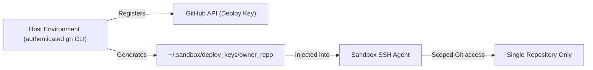

# Security & path masking engine

`bws` is designed for unprivileged, hermetic developer environments and isolated autonomous AI coding agent execution.

---

## Table of contents

* [Threat model & security guarantees](#threat-model--security-guarantees)
* [Path masking mechanics](#path-masking-mechanics)
* [Built-in security & hardening profiles](#built-in-security--hardening-profiles)
* [Git forge and credential containment](#git-forge-and-credential-containment)
* [Automatic `.bws/` workspace protection](#automatic-bws-workspace-protection)
* [Scoped GitHub deploy keys vs account-wide PATs](#scoped-github-deploy-keys-vs-account-wide-pats)

---

## Threat model & security guarantees

1. **No root permissions**: Bubblewrap runs strictly in unprivileged Linux user namespaces (`CLONE_NEWUSER`).
2. **Hermetic `$HOME`**: The host user's personal home directory is completely unmapped.
3. **Environment sanitization**: Host environment variables are not leaked unless explicitly listed in `pass_env`.
4. **Child process termination**: All spawned sandbox processes terminate automatically when `bws` exits (`--die-with-parent`), with signals (`SIGINT`, `SIGTERM`) trapped to guarantee cleanup.
5. **Network access boundary**: By default, `bws` permits outbound network traffic so package managers (`go`, `npm`, `cargo`, `uv`) can function. When air-gapped isolation is desired, passing `-N` / `--offline` or activating the `offline` profile unshares the network namespace (`CLONE_NEWNET`), completely blocking internet connectivity and isolating loopback so host `127.0.0.1` services (databases, dev servers, Ollama, Docker) cannot be reached.

---

## Path masking mechanics

`bws` implements zero-trust **path masking** using two non-destructive overlay primitives:

* **Directories (`--tmpfs <path>`)**: Overlays an empty in-memory `tmpfs` over the directory. Reads return an empty directory; writes exist only in volatile memory and vanish on exit.
* **Files & binaries (`--ro-bind-try /dev/null <path>`)**: Overlays `/dev/null` over the file. Any read returns EOF (0 bytes) and execution attempts fail immediately.

> **Note on primitives**: `bws` matches the overlay primitive to the target path type (directory vs file). Applying a file overlay to a directory path or vice-versa is prevented by the path masking engine.

---

## Built-in security & hardening profiles

| Profile | Target Paths | Protection Provided |
| :--- | :--- | :--- |
| **`no-sudo`** | `sudo`, `su`, `pkexec`, `doas`, `gpasswd`, `newgrp`, `/etc/sudoers` | Prevents privilege escalation and superuser execution |
| **`no-ssh`** | `~/.ssh`, `/etc/ssh/ssh_config` | Blocks access to host private keys and SSH configuration |
| **`no-browser`** | Firefox, Chrome, Chromium, Brave, Edge profiles | Protects saved passwords, web sessions, and browser cookies |
| **`no-email`** | Thunderbird, Evolution, Mutt, Maildir | Shields desktop mailboxes and email credentials |
| **`no-chat`** | Discord, Slack, Signal, Telegram, Element | Protects messaging databases and tokens |
| **`no-secrets`** | `~/.aws`, `~/.azure`, `~/.config/gcloud`, `~/.password-store`, `~/.gnupg`, `~/.git-credentials`, `~/.netrc` | Shields cloud credentials, GPG keys, and Git credential stores |
| **`no-gh`** | `gh`, `~/.config/gh`, `~/.local/share/gh`, `~/.local/state/gh` | Blocks GitHub CLI execution and masks GitHub configuration |
| **`no-history`**| `.bash_history`, `.zsh_history`, XDG history paths, REPL logs | Prevents scanning command histories for leaked tokens (enabled by default) |
| **`offline`** (`no-net`) | Network namespace (`CLONE_NEWNET`) | Blocks all outbound internet traffic and isolates loopback (host `127.0.0.1` services completely unreachable) |
| **`secure-agent`**| All of the above combined + `ai` coding assistant stack | Zero-trust developer sandbox for autonomous coding agents |

---

## Git forge and credential containment

Developer environments and autonomous coding agents commonly run untrusted third-party code, package manager scripts, or unreviewed patches. Leaving forge CLIs and credentials exposed inside a sandbox creates risks of credential theft or unauthorized repository actions.

### Threats addressed

1. **Unauthorized forge CLI execution**: Tools like `gh`, `glab`, `hub`, or `tea` can create repositories, modify pull requests, push tags, or create public gists containing private code.
2. **Credential store exfiltration**: Plaintext tokens stored in `~/.git-credentials`, `~/.config/git/credentials`, `~/.netrc`, `~/.config/netrc`, or forge configuration files (`~/.config/gh/hosts.yml`) can be read and exfiltrated over the network.
3. **Environment token leakage**: Host environment variables like `GH_TOKEN` or `GITHUB_TOKEN` can leak into the sandbox through wildcard environment forwarding.

### Containment mechanisms

`bws` enforces forge and credential containment through multiple layers:

* **Binary execution blocking**: The host `gh` binary path (dynamically detected via `PATH`) and standard installation paths (`/usr/bin/gh`, `/usr/local/bin/gh`, `/bin/gh`, `~/.local/bin/gh`, `~/bin/gh`) are overlaid with `/dev/null`. Execution attempts fail immediately.
* **Sibling forge CLIs**: Binaries for `glab`, `hub`, and `tea` (`/usr/bin/glab`, `/usr/bin/hub`, `/usr/bin/tea`) and their configuration paths (`~/.config/glab-cli`, `~/.config/hub`, `~/.config/tea`) are blocked via `/dev/null` overlays and empty `tmpfs` mounts.
* **Credential stores masked**: `~/.git-credentials`, `~/.config/git/credentials`, `~/.netrc`, `~/.config/netrc`, `~/.config/gh`, `~/.local/share/gh`, and `~/.local/state/gh` are masked with empty `tmpfs` or `/dev/null` overlays.
* **Environment variable scrubbing**: `GH_TOKEN`, `GITHUB_TOKEN`, `GH_ENTERPRISE_TOKEN`, and `GITHUB_ENTERPRISE_TOKEN` are blocked from `pass_env` patterns and wildcards (`GH_*`, `GITHUB_*`). If `clearenv` is disabled (`"clearenv": false`), these tokens are explicitly unset via `--unsetenv`. They are only injected if explicitly defined in `config.Env`.

### Configuration and opt-out

Forge blocking is enabled by default in all sandboxes. It can be toggled via `features.block_gh`:

```jsonc
{
  "features": {
    // Set to false to permit gh execution and unmask forge configs
    "block_gh": false
  }
}
```

---

## Automatic `.bws/` workspace protection

When `bws` launches inside a workspace, the local `.bws/` directory and `.bws.jsonc` file are **automatically masked by default** inside the sandbox:
* Code running inside the bubble cannot inspect host sandbox configuration.
* Untrusted build scripts or autonomous agents cannot modify `.bws/config.jsonc` to weaken sandbox rules on future host invocations.

---

## Scoped GitHub deploy keys vs account-wide PATs

Traditional container environments force developers to choose between broken Git commands or exposing account-wide credentials (like personal access tokens or master SSH keyrings).

`bws` implements automatic **repository-scoped Deploy Keys**:



### Security advantages
1. **Confined blast radius**: If a script or AI agent running inside the sandbox attempts to access other private repositories or GitHub organization settings, the request fails.
2. **Master key protection**: Host keys in `~/.ssh/` (`id_rsa`, `id_ed25519`) are never exposed or mounted into the sandbox.
3. **Automated lifecycle**: `bws` handles key generation, registration via `gh`, and agent loading in milliseconds without manual intervention.
