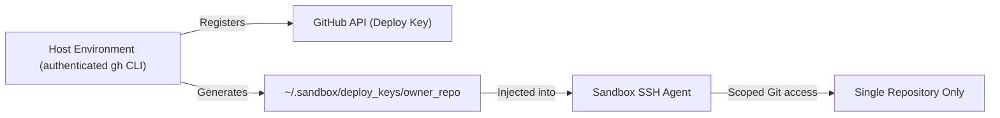

# Security & path masking engine

`bws` is designed for unprivileged, hermetic developer environments and isolated autonomous AI coding agent execution.

---

## Table of contents

* [Threat model & security guarantees](#threat-model--security-guarantees)
* [Path masking mechanics](#path-masking-mechanics)
* [Built-in security & hardening profiles](#built-in-security--hardening-profiles)
* [Automatic `.bws/` workspace protection](#automatic-bws-workspace-protection)

---

## Threat model & security guarantees

1. **No root permissions**: Bubblewrap runs strictly in unprivileged Linux user namespaces (`CLONE_NEWUSER`).
2. **Hermetic `$HOME`**: The host user's personal home directory is completely unmapped.
3. **Environment sanitization**: Host environment variables are not leaked unless explicitly listed in `pass_env`.
4. **Child process termination**: All spawned sandbox processes terminate automatically when `bws` exits (`--die-with-parent`), with signals (`SIGINT`, `SIGTERM`) trapped to guarantee cleanup.
5. **Network access boundary**: `bws` does not isolate network access by default; outbound network access is permitted to allow package managers to function.

---

## Path masking mechanics

`bws` implements zero-trust **path masking** using two non-destructive overlay primitives:

* **Directories (`--tmpfs <path>`)**: Overlays an empty in-memory `tmpfs` over the directory. Reads return an empty directory; writes exist only in volatile memory and vanish on exit.
* **Files & binaries (`--ro-bind-try /dev/null <path>`)**: Overlays `/dev/null` over the file. Any read returns EOF (0 bytes) and execution attempts fail immediately.

> **Note on primitives**: `bws` matches the overlay primitive to the target path type (directory vs file). Applying a file overlay to a directory path or vice-versa is prevented by the path masking engine.

---

## Built-in security & hardening profiles

| Profile | Target Paths | Protection Provided |
| :--- | :--- | :--- |
| **`no-sudo`** | `sudo`, `su`, `pkexec`, `doas`, `gpasswd`, `newgrp`, `/etc/sudoers` | Prevents privilege escalation and superuser execution |
| **`no-ssh`** | `~/.ssh`, `/etc/ssh/ssh_config` | Blocks access to host private keys and SSH configuration |
| **`no-browser`** | Firefox, Chrome, Chromium, Brave, Edge profiles | Protects saved passwords, web sessions, and browser cookies |
| **`no-email`** | Thunderbird, Evolution, Mutt, Maildir | Shields desktop mailboxes and email credentials |
| **`no-chat`** | Discord, Slack, Signal, Telegram, Element | Protects messaging databases and tokens |
| **`no-secrets`** | `~/.aws`, `~/.azure`, `~/.config/gcloud`, `~/.password-store`, `~/.gnupg` | Shields cloud provider credentials and GPG keys |
| **`no-history`**| `.bash_history`, `.zsh_history`, `.python_history`, `.psql_history` | Prevents scanning command histories for leaked tokens |
| **`secure-agent`**| All of the above combined + `ai` coding assistant stack | Zero-trust developer sandbox for autonomous coding agents |

---

## Automatic `.bws/` workspace protection

When `bws` launches inside a workspace, the local `.bws/` directory and `.bws.jsonc` file are **automatically masked by default** inside the sandbox:
* Code running inside the bubble cannot inspect host sandbox configuration.
* Untrusted build scripts or autonomous agents cannot modify `.bws/config.jsonc` to weaken sandbox rules on future host invocations.

---

## Scoped GitHub deploy keys vs account-wide PATs

Traditional container environments force developers to choose between broken Git commands or exposing account-wide credentials (like personal access tokens or master SSH keyrings).

`bws` implements automatic **repository-scoped Deploy Keys**:

### Security advantages
1. **Confined blast radius**: If a script or AI agent running inside the sandbox attempts to access other private repositories or GitHub organization settings, the request fails.
2. **Master key protection**: Host keys in `~/.ssh/` (`id_rsa`, `id_ed25519`) are never exposed or mounted into the sandbox.
3. **Automated lifecycle**: `bws` handles key generation, registration via `gh`, and agent loading in milliseconds without manual intervention.
