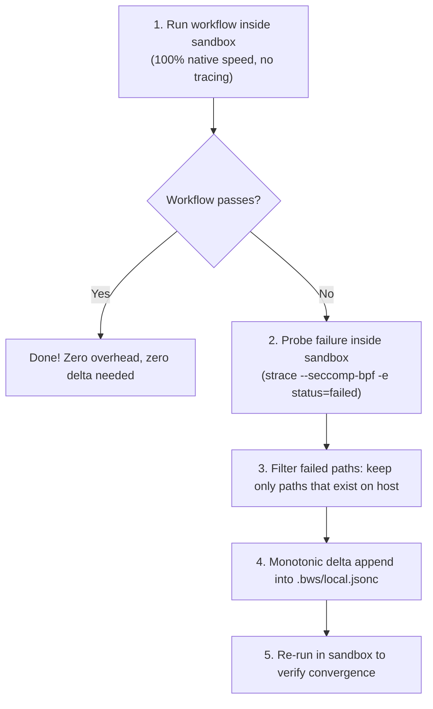

# Workflow-driven sandbox learning architecture (`new_learn`)

*Document status: Approved architectural blueprint · Date: 2026-09-06*

---

## Executive summary

`bws` is transitioning from a catalog of static, pre-baked capability profiles (`go-dev`, `python-dev`, `rust-dev`, etc.) to a **workflow-driven learning model**.

Instead of `bws` speculating on what paths and caches every language toolchain needs across different Linux distributions, the developer provides a project workflow or gate script (e.g. `tools/gate.sh` or `tools/env.sh`). Running `bws learn` traces and synthesizes the exact minimal sandbox boundary required to build, test, and develop the project.

This blueprint establishes the architecture, security guarantees, performance optimizations, and implementation roadmap for `new_learn`.

---

## The core breakthrough: Inverting the trace

Historically, `bws learn` executed `strace` on the **host**, watched hundreds of thousands of successful syscalls across the entire user environment, and attempted to subtract what the sandbox already provided.

The foundational design of `new_learn` inverts this:

> **Execute the workflow *inside* the sandbox under `strace -e status=failed`, capturing only `ENOENT`/`EACCES`/`EPERM` syscalls for paths that exist on the host.**



### Why inverting the trace dissolves the core challenges

| Challenge | Host-side trace (old) | Sandbox failure trace (`new_learn`) |
| :--- | :--- | :--- |
| **Performance & Speed** | 10x–50x ptrace slowdown tracing every `openat`, `stat`, and `read`. | **0 ms overhead on passing runs** (runs untraced). When missing tools, `--seccomp-bpf -e status=failed` records only the few failing syscalls. |
| **Incremental Delta** | Complex path arithmetic subtracting active mounts from hundreds of thousands of trace lines. | **Kernel-computed delta**: Paths already provided by existing mounts never fail, so they never appear in the trace. |
| **Credential & Secret Leakage** | Traces on host can accidentally read `~/.ssh/id_ed25519`, `~/.kube`, `~/.docker`, or `~/.config/gh` and propose mounting them. | **Structurally impossible**: Inside the sandbox, unmounted host secrets do not exist and cannot be read. |

---

## Two kinds of profiles: User profiles (Intent) vs auto profiles (Realization)

To prevent mixing high-level developer intent with low-level machine paths, `new_learn` establishes a clean separation between two distinct profile layers:

```
User Profile (Intent)                 Auto-Profile (Realization)
.bws/config.jsonc                      .bws/local.jsonc
──────────────────────                 ─────────────────────────
"I want tools:                         "Here are the exact host paths
 [go, rust, latex, emacs]"              for this machine:
                                        /usr/lib/go-1.22,
                                        ~/.cargo, /usr/share/texlive"
```

| Dimension | **User Profile** (`.bws/config.jsonc`) | **Auto-Profile** (`.bws/local.jsonc`) |
| :--- | :--- | :--- |
| **What it is** | High-level developer **intent**. | Concrete **machine-specific realization**. |
| **Contents** | List of desired commands / capabilities: `tools: ["go", "rust", "latex", "emacs"]` + hardening masks (`no-sudo`, `no-gh`). | The exact bind mounts (`binds_ro`, `binds_rw`, `path`, env) synthesized by `bws`. |
| **Portability** | **100% portable** across all machines and distros. Checked into Git. | **Machine-local**. Gitignored. |
| **Creation** | Written by the developer or initialized via `bws init`. | Generated by `bws learn` or static probe. |

### Interactive failure mode: The package approval loop

During a host learning session (`bws learn ./tools/gate.sh` or interactive `bws learn`):
1. `bws` executes the workflow inside the sandbox and traces failures (`status=failed`).
2. Discovered missing paths are grouped into logical **auto-packages** (e.g. `/usr/share/texlive`, `pdflatex`, and `kpathsea` grouped as `LaTeX`).
3. The human developer is presented with an interactive checklist on the host terminal:
   ```text
   Workflow attempted to access host tools:

     [x] LaTeX     (/usr/share/texlive, /usr/bin/pdflatex)
     [x] Quarto    (/opt/quarto/bin/quarto, ~/.cache/quarto)
     [ ] SSH keys  (~/.ssh/id_rsa) -> Flagged as sensitive!

   Add selected auto-packages to local environment? [Y/n]
   ```
4. Upon confirmation, `bws` writes the auto-profile to `.bws/local.jsonc` and re-runs to verify convergence.
5. In contrast, autonomous AI agents in `bws gw` run locked against `.bws/local.jsonc` and **never receive approval prompts**, ensuring zero in-sandbox boundary escalation.

---

## Addressing the three design pillars

### 1. Coverage guarantees vs. gate script narrowness

* **The concern**: A narrow test script (`go test ./...`) might miss interactive tools (LSPs like `gopls` or `rust-analyzer`, debuggers like `dlv`, formatters like `gofumpt`) or runtime assets (timezone databases, CA certs).
* **The resolution**:
  1. **System tools already covered**: `bws` already mounts `/usr`, `/bin`, and `/lib*` read-only by default. Distro-packaged compilers, headers, LSPs, `/usr/share/zoneinfo`, and system certs are *already* present in every sandbox.
  2. **Static toolchain queries (Fast-path)**: For user-local installs, `bws` queries toolchain roots directly rather than relying on trace observation:
     * Go: `go env GOROOT GOPATH GOCACHE GOMODCACHE GOBIN`
     * Rust: `rustc --print sysroot`, `$CARGO_HOME`
     * Python: `sys.prefix`, `site.getusersitepackages()`, `$VIRTUAL_ENV`
     * Node: `npm config get prefix cache`
     This resolves toolchain roots in ~10 ms and is immune to warm-cache under-learning.
  3. **Host-only authority & in-sandbox immutability**:
     The AI agent inside the bubble is an untrusted actor. It must **never** be able to reconfigure the sandbox, discover unmounted host binaries, or expand its own perimeter.
     * `bws` configuration (`.bws/` and `.bws.jsonc`) remains masked inside the container.
     * `bws learn` and `bws mount` are strictly **host-side developer commands**.
     * If an agent inside the sandbox attempts to run a missing or unmounted command, it must fail immediately (`command not found`). It cannot invoke `bws` or self-promote privileges. Missing tool additions must be evaluated and approved by the human developer on the host.

---

### 2. Incremental delta learning (Learning ONLY what is new)

* **The concern**: Re-running `learn` on an updated script must not wipe custom mounts, re-trace covered files, or bloat configuration files.
* **The resolution**:
  1. **Effective mount-set filtering**: Discovered paths are matched against the effective mount table generated by `BuildArgs(dryRun=true)`. Any path already reachable under an existing mount is immediately discarded.
  2. **Strict monotonic addition**: `new_learn` only calculates `Delta = Discovered - ExistingMounts`. It never deletes existing mounts during normal updates.
  3. **Configuration split (Portability & Provenance)**:
     * **`.bws/config.jsonc` (Committed to Git)**: Declares project intent, shared profiles (`no-secrets`, `no-sudo`), and team-wide settings.
     * **`.bws/local.jsonc` (Gitignored)**: Stores machine-specific learned mounts (e.g. `/opt/quarto-1.4.5`, `/usr/lib/jvm/...`). This eliminates host path divergence in committed repositories.

---

### 3. Trace performance & execution speed

* **The concern**: `strace` ptrace context switches are unacceptably slow for daily development loops.
* **The resolution**:
  1. **Probe-first execution**: Run untraced in the sandbox. If the workflow exits 0, no tracing occurs at all.
  2. **`--seccomp-bpf` (strace ≥ 5.3)**: Installs kernel-level seccomp filters so untraced syscalls never trap to userspace.
  3. **Syscall pruning**: Drop the high-volume `stat` family (`stat`, `lstat`, `newfstatat`, `statx`, `access`) from default tracing. Trace only `execve`, `execveat`, and `openat`.
  4. **Drop `LD_PRELOAD`**: Do not implement an `LD_PRELOAD` interceptor. Go and statically linked Rust binaries bypass `libc` syscall wrappers entirely, `LD_PRELOAD` is stripped under `AT_SECURE`, and compiling native C libraries violates the single static binary architecture of `bws`.

---

## Critical bugs identified in existing codebase

1. **Missing `execve`/`execveat` in `internal/learn/trace.go`**:
   `trace.go:44` only traces `open, openat, creat, stat...` without `execve`. As a result, running `bws learn ./tools/gate.sh` cannot discover any child binaries the script executes.
2. **Plaintext credential leak in `profiles/git.json`**:
   `profiles/git.json` declares a read-only bind for `~/.git-credentials`. While neutralized by the default `BlockGH` feature, this entry must be permanently purged.
3. **Read-side secret denylist gaps**:
   `filter.go:47-57` currently checks only 9 secret directories. Host-side tracing can accidentally expose `~/.ssh`, `~/.kube`, `~/.docker`, or `~/.npmrc`. Moving to in-sandbox failure tracing structurally fixes this.

---

## Prioritized implementation roadmap

### P0 — Immediate foundational fixes
* [ ] **Add `execve` / `execveat` tracing**: Update `internal/learn/trace.go` and `parser.go` to capture executable launches and feed them into PATH discovery.
* [ ] **Purge `~/.git-credentials` from `git.json`**: Remove credential file binds from `profiles/git.json` and `internal/profile/embedded_profiles/git.json`.
* [ ] **In-sandbox failure tracer (`bws learn --probe`)**: Implement running the target workflow inside Bubblewrap with `strace --seccomp-bpf -e status=failed -e trace=openat,execve,execveat`.
* [ ] **Atomic config writes**: Ensure `ApplyDelta` writes through a temporary file with `os.Rename` and propagates errors.

### P1 — Developer ergonomics & toolchain speed
* [ ] **Static toolchain discovery queries**: Implement fast-path queries for Go, Rust, Python, and Node toolchain roots (`go env`, `rustc --print sysroot`).
* [ ] **Configuration split**: Support `.bws/local.jsonc` (gitignored, learned machine mounts) merged on top of `.bws/config.jsonc` (committed intent).
* [ ] **`bws verify [script]`**: Run the workflow script in-sandbox and report pass/fail convergence.

### P2 — Architectural consolidation
* [ ] **Type distinction for profiles**: Introduce `kind: "hardening" | "capability"` in profile schemas; retain built-in hardening profiles (`no-sudo`, `no-ssh`, `no-gh`, `no-secrets`, `no-history`, `offline`), deprecate built-in language toolchains.
* [ ] **`bws learn --prune`**: Allow removing stale mounts when dependencies are removed from a project.
