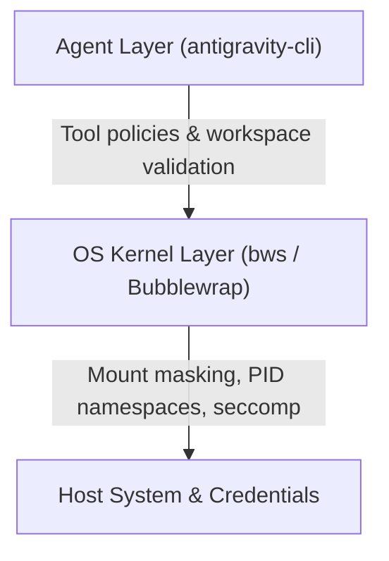

# Sandbox audit and comparison summary

## Overview
This document summarizes the sandbox audit methodology, live environment diagnostic results, and a comparison between application-level agent guardrails (`antigravity-cli`) and Linux kernel-level isolation (`bws` / Bubblewrap).

---

## 1. Sandbox evaluation dimensions

To evaluate sandbox strength on Linux, probe five isolation layers:

| Layer | Audit check | Target sandbox behavior |
| :--- | :--- | :--- |
| **PID namespace** | `ps -ef` / count `/proc/[0-9]*` | Isolated PID namespace; only internal sandbox processes (PID 1+) visible. |
| **Filesystem & secrets** | Read `~/.ssh`, `~/.aws`, `~/.gnupg`, `/root` | Sensitive paths masked with empty `tmpfs` or unmounted; system directories read-only. |
| **Privileges & capabilities** | Inspect `/proc/self/status` | `NoNewPrivs: 1` set; capabilities zeroed (`0000000000000000`). |
| **Device nodes** | Inspect `/dev` | Minimal pseudo-devices (`/dev/null`, `/dev/urandom`, etc.); no raw block devices. |
| **Network & loopback** | `ss -tulpn` / socket tests | Isolated network namespace or restricted access to host loopback services. |

---

## 2. Diagnostic audit script

```ruby
#!/usr/bin/env ruby
# sandbox_audit.rb

def check(title)
  puts "\n=== #{title} ==="
  yield
rescue => e
  puts "Error: #{e.message}"
end

check("PID Namespace (visible process count)") do
  pids = Dir.glob('/proc/[0-9]*').map { |p| File.basename(p).to_i }
  puts "Total visible processes: #{pids.count}"
end

check("Sensitive Directories Access") do
  %w[~/.ssh ~/.gnupg ~/.aws /root].each do |path|
    exp = File.expand_path(path)
    readable = File.readable?(exp)
    puts "#{path}: #{readable ? 'EXPOSED' : 'HIDDEN/PROTECTED'}"
  end
end

check("NoNewPrivs & Capabilities") do
  if File.exist?('/proc/self/status')
    status = File.read('/proc/self/status')
    matches = status.scan(/^(NoNewPrivs|Cap(Inh|Prm|Eff|Bnd)):\s+(.*)$/)
    puts matches.map { |k, _, v| "#{k}: #{v}" }.join("\n")
  end
end
```

---

## 3. Live audit findings

Execution output in the current environment:

```
=== PID Namespace (visible process count) ===
Total visible processes: 656

=== Sensitive Directories Access ===
~/.ssh: EXPOSED
~/.gnupg: HIDDEN/PROTECTED
~/.aws: HIDDEN/PROTECTED
/root: HIDDEN/PROTECTED

=== NoNewPrivs & Capabilities ===
CapInh: 0000000000000000
CapPrm: 0000000000000000
CapEff: 0000000000000000
CapBnd: 0000000000000000
NoNewPrivs: 1
```

### Analysis of results
1. **Process isolation (unisolated)**: 656 host processes are visible. The environment shares the host PID namespace.
2. **Secret exposure (partial)**: `~/.ssh` is readable from shell commands.
3. **Privilege lockdown (active)**: `NoNewPrivs: 1` is enabled and all Linux capabilities are dropped, preventing `sudo` / `setuid` privilege escalation.

---

## 4. Comparison: `antigravity-cli` vs `bws` (Bubblewrap)

| Feature | `antigravity-cli` default | `bws` (Bubblewrap) |
| :--- | :--- | :--- |
| **Enforcement mechanism** | Application-level tool policies & `NoNewPrivs` | Linux kernel namespaces (`pid`, `mount`, `ipc`, `net`) |
| **PID visibility** | Host PID namespace shared | Isolated PID namespace (PID 1 root inside sandbox) |
| **Path masking** | Tool boundary checks | Kernel bind mounts (empty `tmpfs` over sensitive paths) |
| **Shell command safety** | Unrestricted filesystem read access for user-owned files | Hard read-only / masked boundaries enforced by kernel |
| **Syscall filtering** | Standard user permissions | Seccomp filter capability |

---

## 5. Recommended defense-in-depth architecture

Combining both tools provides multi-layered protection:



### Usage
Launch the `agy` CLI directly inside a `bws` sandbox:

```bash
bws agy
```
